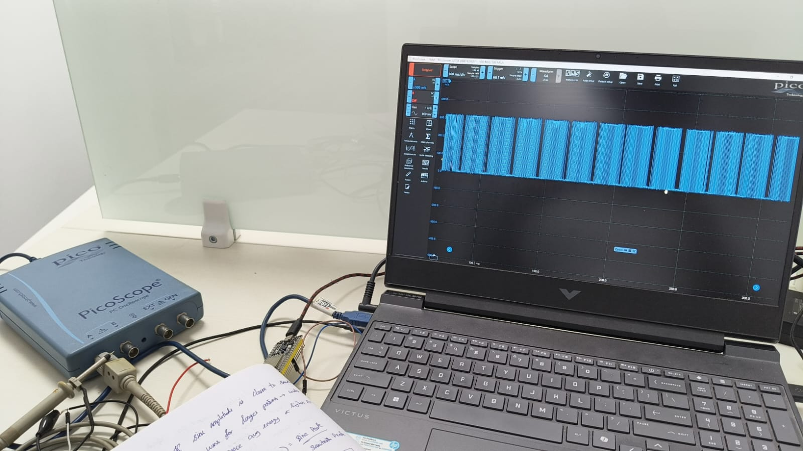
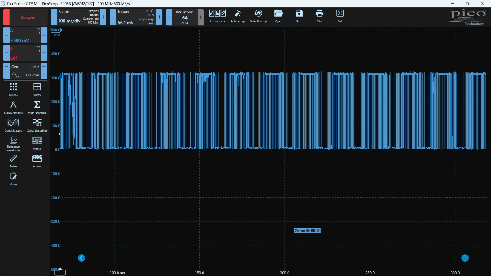

# ESP32 SPWM Signal Generator

A project implementing Sinusoidal Pulse Width Modulation (SPWM) using an ESP32 microcontroller, verified with PicoScope, and simulated in MATLAB.

## Overview
This project demonstrates the generation of SPWM signals by comparing a 50Hz sine reference wave with a 2kHz sawtooth carrier wave. 

## Project Visuals
### Physical Setup & Validation

*Physical hardware implementation showing the ESP32 connected to the PicoScope.*

*Measured SPWM waveform observed using PicoScope 7 T&M software.*

### MATLAB Simulation

*SPWM logic simulation in MATLAB, showing the sine reference and resulting PWM output.*

## Key Skills
- Embedded C++ firmware development for ESP32.
- Signal processing and power electronics theory.
- Data acquisition and validation using PicoScope.
- System modeling using MATLAB.
